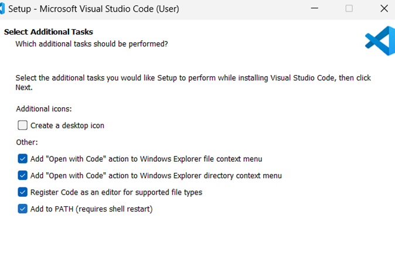
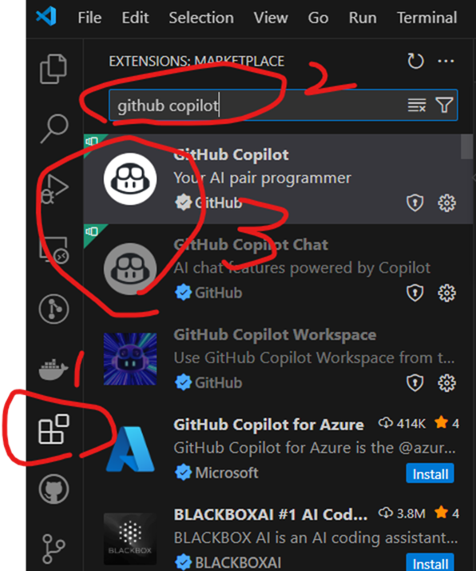

# GitHub Copilot 教學

## 下載 Visual Studio Code
1. 前往 [Visual Studio Code 官方網站](https://code.visualstudio.com/
)。
2. 下載適合您操作系統的版本。

3. 安裝 Visual Studio Code。
4. 盡量勾選會比較方便

## 安裝 GitHub Copilot
1. 選擇左側的擴展圖示（Extensions）。
2. 在搜尋框中輸入 "GitHub Copilot"。
3. 點擊 "Install" 按鈕安裝擴展, Github Copilot and Github Copilot Chat。

